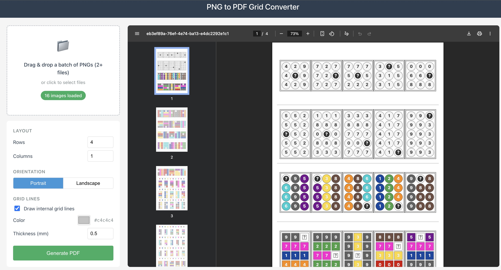

# PNG to PDF Grid Converter

A web application that converts multiple PNG images into a single PDF document with a customizable grid layout.



## Features

- **Drag & Drop** - Easily upload multiple PNG files at once
- **Grid Layout** - Arrange images in a customizable grid (rows × columns)
- **Orientation** - Choose between portrait and landscape PDF output
- **Grid Lines** - Add optional grid lines with customizable color and thickness
- **Live Preview** - See your PDF layout before generating
- **Client-Side Processing** - All processing happens in the browser, no server uploads

## Getting Started

### Prerequisites

- Node.js (v18 or higher recommended)

### Installation

```bash
npm install
```

### Development

```bash
npm run dev
```

### Build

```bash
npm run build
```

### Preview Production Build

```bash
npm run preview
```

## Tech Stack

- React 19
- Vite 7
- jsPDF - PDF generation
- react-dropzone - File drag & drop handling

## Usage

1. Drag and drop PNG images onto the drop zone (or click to select files)
2. Adjust the grid layout (rows and columns)
3. Choose orientation (portrait or landscape)
4. Optionally enable grid lines and customize their appearance
5. Click "Generate PDF" to download your PDF

## License

MIT
